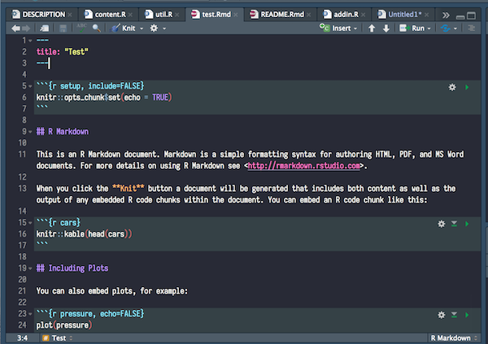
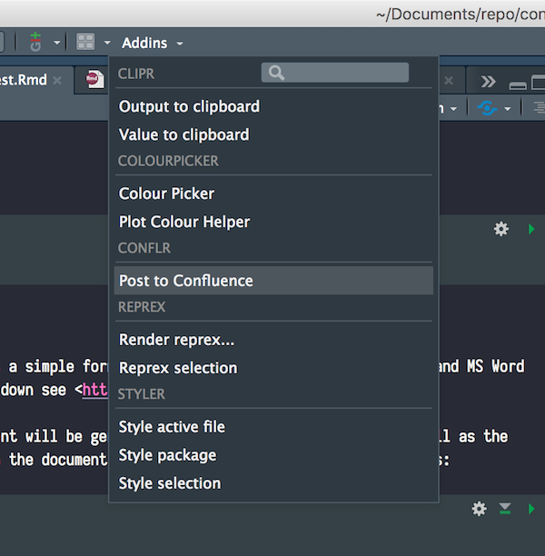
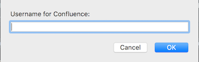
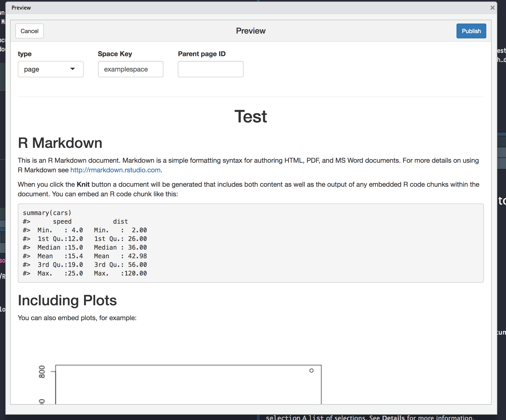
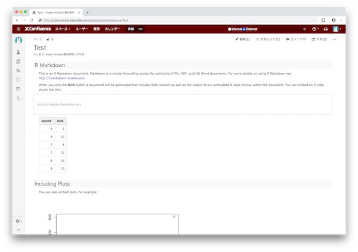

<!-- README.md is generated from README.Rmd. Please edit that file -->

```{r setup, include = FALSE}
knitr::opts_chunk$set(
  collapse = TRUE,
  comment = "#>",
  fig.path = "man/figures/README-",
  out.width = "100%"
)
```

# conflr

[](https://travis-ci.org/line/conflr)

conflr is an R package to post [R Markdown](https://rmarkdown.rstudio.com/) documents to [Confluence](https://www.atlassian.com/software/confluence), a content collaboration tool by Atlassian.

## Installation

You can install conflr from GitHub.

``` r
# install.packages("devtools")
devtools::install_github("line/conflr")
```

## Preparation

conflr uses these environmental variables to access your Confluence.

* `CONFLUENCE_URL`: The base URL of your Confluence. e.g. `https://confluence.example.com` (On Atlassian Cloud, `https://<your-domain>.atlassian.net/wiki`).
* `CONFLUENCE_USERNAME`: Your username (On Atlassian Cloud, your email address).
* `CONFLUENCE_PASSWORD`: Your password (On Atlassian Cloud, your API token. For more details about API token, please read [the official document](https://confluence.atlassian.com/cloud/api-tokens-938839638.html)).

There are several ways to set these environmental variables. The quickest way is to enter in the popups that are displayed when you run the addin (see Usages section below). The inputs are cached in the environmental variables listed above by default.

Another way is to set the variables in the `.Renviron` file (you can open the file with `usethis::edit_r_environ()`). For example, you can set the base URL in the file as the following.

```
CONFLUENCE_URL=https://confluence.example.com
```

## Usages

conflr provides several ways to post R Markdown documents to Confluence.

1. Use an RStudio Addin
2. Run `confl_create_post_from_Rmd()` on console
3. Specify `conflr::confluence_document` on the YAML front-matter

### RStudio Addin

#### 1. Move focus to the .Rmd file and click "Post to Confluence" Addin

(**Caution for those who are not familiar with R Markdown**: R Markdown's powerfulness allows you to execute arbitrary code; be sure about what the code does before clicking "Post to Confluence"!)





Then, you will be asked your username and password.



#### 2. Check the preview and click "Publish"

* **type**: The type of the page (*page* means a normal wiki page, whereas *blogpost* mean a blog post, not a page).
* **Space Key**: The key of the space you want to post.
* **Parent page ID**: (optional): The ID of the parent page to the page.
* **Use original image sizes**: If checked, do not resize the images.
* **TOC**: If checked, add a Table of Contents.
* **TOC depth**: The lowest heading level to include in the Table of Contents.



#### 3. Check the result



### `confl_create_post_from_Rmd()`

If you don't use RStudio, use `confl_create_post_from_Rmd()`, which is run inside the addin above.
The basic usage is

``` r
confl_create_post_from_Rmd("~/path/to/your.Rmd")
```

#### Batch use

If you want to use this function without interaction, specify `interactive = FALSE`.
This skips any confirmations or previews.

``` r
confl_create_post_from_Rmd("~/path/to/your.Rmd", interactive = FALSE)
```

Note that, if you want to run this periodically, you probably need to set `update = TRUE` to allow
conflr to overwrite the existing page.

``` r
confl_create_post_from_Rmd("~/path/to/your.Rmd", interactive = FALSE, update = TRUE)
```

### `conflence_document`

``` md
---
title: "title1"
output:
  confluence_document:
    space_key: "space1"
    parent_id: 1234
    toc: TRUE
    toc_depth: 4
    supported_syntax_highlighting:
      r: r
      foo: bar
    update: true
    use_original_size: true
---

...
```

## Options

conflr recognizes these options:

* `conflr_supported_syntax_highlighting`: A character vector of languages that your Confluence supports the syntax highlighting in addition to the default languages (by default, `sql`, `cpp`, `python`, `html`, `css`, `bash`, and `yaml` are supported).
* `conflr_addin_clear_password_after_success`: If `TRUE`, unset `CONFLUENCE_PASSWORD` after the page is successfully uploaded via addin.

## Know limitations

### LaTeX support

conflr supports [Math expressions](https://bookdown.org/yihui/rmarkdown/markdown-syntax.html#math-expressions) to some extent. But, it requires [LaTeX Math addon](https://marketplace.atlassian.com/apps/1210882/latex-math) installed. Otherwise, you will see "unknown macro" errors on the page.

### htmlwidgets (e.g. leaflet, plotly)

conflr doesn't support htmlwidgets-based packages like leaflet and plotly.
Instead, you can embed the screenshot by setting `screenshot.force = TRUE` in the chunk option (c.f. https://bookdown.org/yihui/bookdown/html-widgets.html).

## Advanced Usages

conflr is also a (non-complete) binding to [Confluence's REST API](https://developer.atlassian.com/server/confluence/confluence-server-rest-api/). These low-level functions might be useful when you need to access to your Confluence programmatically.

```{r load_library, eval=FALSE}
library(conflr)

# list pages
res <- confl_list_pages(spaceKey = "foo")
purrr::map_chr(res$results, "id")

# get page info
page <- confl_get_page(res$results[[2]]$id)
page$title

# create a page
new_page <- confl_post_page(
  spaceKey = "foo",
  title = "Test",
  body = glue::glue(
    '<ac:structured-macro ac:name="code">
     <ac:plain-text-body><![CDATA[this is my code]]></ac:plain-text-body>
     </ac:structured-macro>
    '))
new_page$`_links`
```

## How to contribute
See [CONTRIBUTING.md](CONTRIBUTING.md)

## License
```
Copyright (C) 2019 LINE Corporation

This program is free software: you can redistribute it and/or modify
it under the terms of the GNU General Public License as published by
the Free Software Foundation, version 3.

This program is distributed in the hope that it will be useful,
but WITHOUT ANY WARRANTY; without even the implied warranty of
MERCHANTABILITY or FITNESS FOR A PARTICULAR PURPOSE.  See the
GNU General Public License for more details.

You should have received a copy of the GNU General Public License
along with this program.  If not, see <http://www.gnu.org/licenses/>.
```
See [LICENSE.md](LICENSE.md) for more detail.
