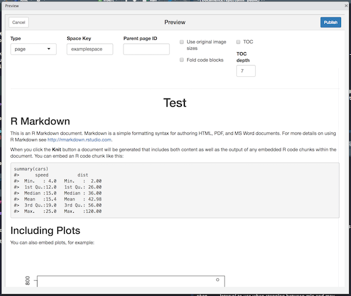

<!-- README.md is generated from README.Rmd. Please edit that file -->

# :warning: conflr is retired! :warning:

conflr is an R package to post [R
Markdown](https://rmarkdown.rstudio.com/) documents to
[Confluence](https://www.atlassian.com/software/confluence), a content
collaboration tool by Atlassian.

While the package still can be found useful, we decided to **archive the
project at the beginning of July 2023**.

The main reason is that conflr will be superseded by Quarto. Quarto v1.3
gained the functionality to publish documents into Confluence ([the
official
announcement](https://quarto.org/docs/blog/posts/2023-03-20-confluence/).
This looks promising. At the moment, there might be some missing
features compared to conflr, but it should be just a matter of time
before Quarto supersedes conflr in all aspects, considering it’s one of
Posit’s flagship projects.

Another reason is that conflr has a technical debt; the primary target
of conflr was the on-premise version of Confluence. The on-premise
version [will be sunset in Feb
2024](https://www.atlassian.com/migration/assess/journey-to-cloud), so
conflr should also switch to the cloud version. However, since the
on-premise version and the cloud version have different syntax and
plugins, it’s not easy to migrate. Considering we don’t have much
development bandwidth for this project, we conclude it’s not really
feasible to support the cloud version.

Thank you for all your support on conflr. While it’s a bit sad to
announce the retirement, we are very happy to see this great evolution
in the documentation ecosystem!

------------------------------------------------------------------------

## Installation

Install conflr from CRAN with:

``` r
install.packages("conflr")
```

Alternatively, if you need the development version, install it with:

``` r
# install.packages("devtools")
devtools::install_github("line/conflr")
```

## Preparation

conflr uses these environmental variables to access your Confluence.

- `CONFLUENCE_URL`: The base URL of your Confluence.
  e.g. `https://confluence.example.com` (On Atlassian Cloud,
  `https://<your-domain>.atlassian.net/wiki`).
- `CONFLUENCE_USERNAME`: Your username (On Atlassian Cloud, your email
  address).
- `CONFLUENCE_PASSWORD`: Your password (On Atlassian Cloud, your API
  token. For more details about API token, please read [the official
  document](https://confluence.atlassian.com/cloud/api-tokens-938839638.html)).

There are several ways to set these environmental variables. The
quickest way is to enter in the popups that are displayed when you run
the addin (see Usages section below). The inputs are cached in the
environmental variables listed above by default.

Another way is to set the variables in the `.Renviron` file (you can
open the file with `usethis::edit_r_environ()`). For example, you can
set the base URL in the file as the following.

    CONFLUENCE_URL=https://confluence.example.com

## Usages

conflr provides the following ways to post R Markdown documents to
Confluence.

1.  Use an RStudio Addin
2.  Run `confl_create_post_from_Rmd()` on console
3.  Specify `conflr::confluence_document` on the YAML front-matter

### RStudio Addin

#### 1. Move focus to the .Rmd file and click “Post to Confluence” Addin

(**Caution for those who are not familiar with R Markdown**: R
Markdown’s powerfulness allows you to execute arbitrary code; be sure
about what the code does before clicking “Post to Confluence”!)


Then, you will be asked your username and password.


#### 2. Check the preview and click “Publish”

- **type**: The type of the page (*page* means a normal wiki page,
  whereas *blogpost* mean a blog post, not a page).
- **Space Key**: The key of the space you want to post.
- **Parent page ID**: (optional): The ID of the parent page to the page.
- **Use original image sizes**: If checked, do not resize the images.
- **Fold code blocks**: If checked, code blocks are folded by default.
- **TOC**: If checked, add a Table of Contents.
- **TOC depth**: The lowest heading level to include in the Table of
  Contents.



#### 3. Check the result


### `confl_create_post_from_Rmd()`

If you don’t use RStudio, you can use `confl_create_post_from_Rmd()`.
The basic usage is

``` r
confl_create_post_from_Rmd("~/path/to/your.Rmd")
```

#### Batch use

If you want to use this function without interaction, specify
`interactive = FALSE`. This skips any confirmations or previews.

``` r
confl_create_post_from_Rmd("~/path/to/your.Rmd", interactive = FALSE)
```

Note that, if you want to run this periodically, you also need to set
`update = TRUE` to allow conflr to overwrite the existing page.

``` r
confl_create_post_from_Rmd("~/path/to/your.Rmd", interactive = FALSE, update = TRUE)
```

### `conflr::confluence_document`

conflr’s functionality is also available as a custom R Markdown format;
You can specify `conflr::confluence_document` to `output` in the front
matter of your R Markdown document.

For example, if you set the following front matter, pressing `Knit`
button on RStudio (or running `rmarkdown::render()`) will publish the R
Markdown document to Confluence.

``` md
---
title: "title1"
output:
  conflr::confluence_document:
    space_key: "space1"
    update: true
---

...
```

For the detail about available options, please refer to
[`?confluence_document`](https://line.github.io/conflr/reference/confluence_document.html).

## Options

conflr recognizes these options:

- `conflr_supported_syntax_highlighting`: A character vector of
  languages that your Confluence supports the syntax highlighting in
  addition to the default languages (by default, `sql`, `cpp`, `python`,
  `html`, `css`, `bash`, and `yaml` are supported).
- `conflr_addin_clear_password_after_success`: If `TRUE`, unset
  `CONFLUENCE_PASSWORD` after the page is successfully uploaded via
  addin.

## Know limitations

### LaTeX support

conflr supports [Math
expressions](https://bookdown.org/yihui/rmarkdown/markdown-syntax.html#math-expressions)
to some extent. But, it requires [LaTeX Math
addon](https://marketplace.atlassian.com/apps/1210882/latex-math)
installed. Otherwise, you will see “unknown macro” errors on the page.

### htmlwidgets (e.g. leaflet, plotly)

conflr doesn’t support htmlwidgets-based packages like leaflet and
plotly. Instead, you can embed the screenshot by setting
`screenshot.force = TRUE` in the chunk option (c.f.
<https://bookdown.org/yihui/bookdown/html-widgets.html>).

## Advanced Usages

conflr is also a (non-complete) binding to [Confluence’s REST
API](https://developer.atlassian.com/server/confluence/confluence-server-rest-api/).
These low-level functions might be useful when you need to access to
your Confluence programmatically.

``` r
library(conflr)

# list pages
res <- confl_list_pages(spaceKey = "foo")
purrr::map_chr(res$results, "id")

# get page info
page <- confl_get_page(res$results[[2]]$id)
page$title

# create a page
new_page <- confl_post_page(
  spaceKey = "foo",
  title = "Test",
  body = glue::glue(
    '<ac:structured-macro ac:name="code">
     <ac:plain-text-body><![CDATA[this is my code]]></ac:plain-text-body>
     </ac:structured-macro>
    '))
new_page$`_links`
```

## How to contribute

See [CONTRIBUTING.md](CONTRIBUTING.md)

## License

    Copyright (C) 2019 LINE Corporation

    This program is free software: you can redistribute it and/or modify
    it under the terms of the GNU General Public License as published by
    the Free Software Foundation, version 3.

    This program is distributed in the hope that it will be useful,
    but WITHOUT ANY WARRANTY; without even the implied warranty of
    MERCHANTABILITY or FITNESS FOR A PARTICULAR PURPOSE.  See the
    GNU General Public License for more details.

    You should have received a copy of the GNU General Public License
    along with this program.  If not, see <http://www.gnu.org/licenses/>.

See [LICENSE.md](LICENSE.md) for more detail.
